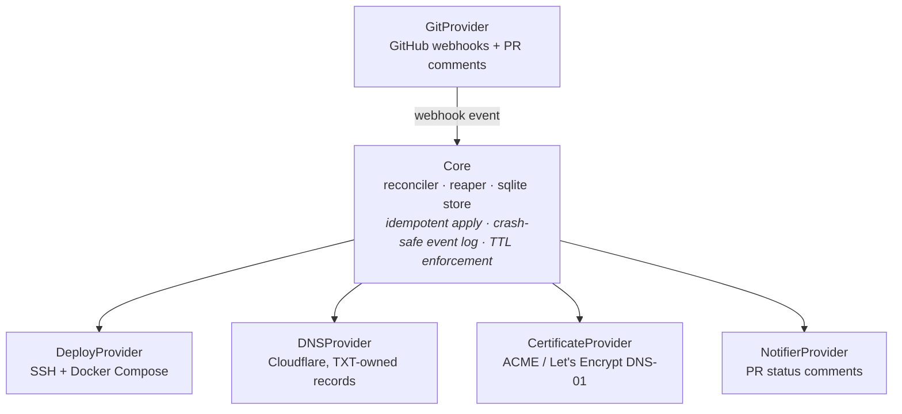
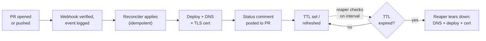

<div align="center">

# Ramify

**Every branch becomes a live URL. Every URL knows when to die.**

A self-hosted, open-source control plane that turns Git branches and pull requests
into short-lived, automatically routed, automatically expiring preview environments —
deployed to infrastructure you already operate.

[](https://github.com/khanalsaroj/ramify/actions/workflows/ci.yml)
[](go.mod)
[](LICENSE)
[](docs/quickstart.md)

[Quickstart](#quickstart) · [Documentation site](#documentation) · [Architecture](#how-it-works) · [CLI](#cli-reference) · [Configuration](#configuration)

</div>

---

## What it does

Push a branch, open a pull request — within seconds you get a real URL
(`your-branch.preview.example.com`) with a real Let's Encrypt certificate, running
your app on a VPS you already control. Close the PR, or let the TTL run out, and
Ramify tears the whole thing down: deployment, DNS record, and certificate,
together, automatically.

- **Owns the full lifecycle, not just a tunnel.** Real DNS records at your
  provider, real certificates via ACME DNS-01 — not a proxy tunnel into an
  environment someone else routes.
- **Deploys to infrastructure you already run.** SSH + `docker compose` on a VPS
  you control. No hosted control plane, nothing about your app leaves your infra.
- **Crash-safe by construction.** Every reconciliation event is logged *before*
  any provider is called. Restart after a crash and `ramifyd` replays whatever
  didn't finish — nothing is silently lost or double-applied.
- **Idempotent everything.** Deploy, DNS, and certificate operations are all safe
  to retry. TXT-record ownership tagging (external-dns style) means Ramify never
  touches a DNS record it doesn't own.
- **Actually expires.** Every successful apply sets or refreshes a TTL. A reaper
  loop enforces it on a schedule — no forgotten environments quietly burning
  compute for months.
- **One job.** Not a PaaS, not a dashboard, not a hosted service — a focused
  control plane for one thing: ephemeral preview environments driven by git
  activity.

### Ramify vs. the alternatives

| | **Ramify** | Preevy | Coolify / Dokploy |
|---|---|---|---|
| What it is | Preview-environment control plane | Environment tunneling tool | General-purpose self-hosted PaaS |
| DNS + TLS lifecycle | Owned end-to-end — real records, real certs | Not owned — tunnels traffic in instead | Not automated for previews |
| Auto-expiry (TTL) | Built in — a reaper tears environments down on schedule | Not the focus | Not the focus |
| Deploys to | Infrastructure you already run, over SSH | Infrastructure you already run | Infrastructure you already run |
| Scope | One job: ephemeral envs from git activity | Tunneling, primarily | General app hosting/PaaS |

## Documentation

This README is the map. Everything else lives in one of these:

| | |
|---|---|
| **[Documentation site](docs/index.html)** | Overview, architecture, install, quickstart, CLI reference, config reference, FAQ — one page. Serve it with GitHub Pages (see below) or open the file directly. |
| **[`docs/quickstart.md`](docs/quickstart.md)** | Zero to a working setup against a real GitHub repo, Cloudflare zone, and VPS — every command verified against a real generated config. |
| **[`docs/providers.md`](docs/providers.md)** | The provider architecture, the shared contract test suites, and how to run them against a real account instead of the in-memory fakes CI uses. |
| **[`DECISIONS.md`](DECISIONS.md)** | Every judgment call made during the build, and what's explicitly deferred — including an honest note on what's *not* independently verified yet. |
| **[`CONTRIBUTING.md`](CONTRIBUTING.md)** | Dev setup, required checks, commit style. |

**Turning on the documentation site:** Settings → Pages → Build and deployment →
Deploy from a branch → Branch: `main`, folder: `/docs`. Publishes at
`https://<owner>.github.io/ramify/`.

## How it works

`ramifyd`'s core — reconciler, reaper, and SQLite state store — never talks to a
Git host, a deploy target, a DNS API, an ACME CA, or a notification channel
directly. It only knows five interfaces in `providers/providerapi`; everything
under `providers/` is a concrete implementation of one of them.



Write your own provider by implementing one of these interfaces and wiring it into
`ramifyd`'s startup — a shared **contract test suite** per interface (in
`test/contract`) pins down the minimum behavior any implementation must satisfy,
built-in or not: idempotent create/update, correct teardown, ownership-checked
deletes.

### One reconciliation, start to finish



## Quickstart

Prerequisites: a GitHub repo, a Cloudflare-managed DNS zone, one VPS you control
with Docker + Compose, and Go 1.23+ locally to build the binaries (no releases
published yet).

```sh
# 1. Build
git clone https://github.com/khanalsaroj/ramify.git && cd ramify
go build -o ramify   ./cmd/ramify
go build -o ramifyd  ./cmd/ramifyd
sudo mv ramify ramifyd /usr/local/bin/

# 2. Set up directories and a deploy key
ramify install --config-dir /etc/ramify --data-dir /var/lib/ramify
ssh-keygen -t ed25519 -N "" -f /etc/ramify/deploy_key
ssh-copy-id -i /etc/ramify/deploy_key.pub ramify@YOUR_VPS_IP

# 3. Generate ramify.yaml (secrets are resolved from the environment, never
#    written to disk literally — see the Configuration section below)
export RAMIFY_GITHUB_TOKEN=ghp_...
export RAMIFY_GITHUB_WEBHOOK_SECRET=$(openssl rand -hex 32)
export RAMIFY_CLOUDFLARE_API_TOKEN=...
ramify init --output /etc/ramify/ramify.yaml \
  --base-domain preview.example.com \
  --github-token '$RAMIFY_GITHUB_TOKEN' \
  --github-webhook-secret '$RAMIFY_GITHUB_WEBHOOK_SECRET' \
  --deploy-ssh-addr YOUR_VPS_IP:22 --deploy-ssh-key /etc/ramify/deploy_key \
  --deploy-compose-file /srv/ramify/docker-compose.yml --deploy-dns-target YOUR_VPS_IP \
  --dns-zone preview.example.com --cloudflare-token '$RAMIFY_CLOUDFLARE_API_TOKEN' \
  --acme-email you@example.com

# 4. Validate, then run
ramify doctor --config /etc/ramify/ramify.yaml
sudo ramifyd --config /etc/ramify/ramify.yaml
```

Add the webhook (`https://your-ramifyd-host/webhooks/github`, "Pull requests" +
"Pushes" events, secret from step 3) and open a PR — `ramify status
your-branch-name` reports `ready` once it's live.

**The full walkthrough** — with the Compose file, systemd unit, and every step
explained — is in [`docs/quickstart.md`](docs/quickstart.md) or the
[documentation site](docs/index.html).

## CLI reference

`ramify` talks to a running `ramifyd` over its local control API — a unix socket
by default, or a token-protected TCP address via `--addr`/`--token`.

| Command | Flags | Does |
|---|---|---|
| `ramify install` | `--config-dir`, `--data-dir` | Creates the config/data directories, ready for `init` |
| `ramify init` | `--output`, `--base-domain`, `--github-*`, `--deploy-ssh-*`, `--deploy-compose-file`, `--dns-zone`, `--cloudflare-token`, `--acme-email`, `--default-ttl`… | Generates `ramify.yaml` non-interactively, scriptable end to end |
| `ramify list` | `--project` | Lists every preview environment as a table |
| `ramify status <branch>` | `--project` | Shows full detail for one branch's environment |
| `ramify logs <branch>` | `--project` | Prints the deployed container's logs |
| `ramify destroy <branch>` | `--project`, `-y`/`--yes` | Tears an environment down manually, with a confirmation prompt |
| `ramify doctor` | `--config` | Validates config, Cloudflare, SSH, webhook secret, and ACME connectivity — independently, with named failures |

Full flags per command: `ramify <command> --help`.

## Configuration

One YAML file. Any field ending in a secret accepts a literal value or a
`$NAME`/`${NAME}` reference resolved from the environment at load time — Ramify
logs which secret fields were configured, never their values.

```yaml
base_domain: preview.example.com   # feature-x → feature-x.preview.example.com

reaper:
  interval: 5m
  default_ttl: 72h                 # TTL applied to a new environment

github:
  token: $RAMIFY_GITHUB_TOKEN
  webhook_secret: $RAMIFY_GITHUB_WEBHOOK_SECRET

deploy:
  ssh_addr: deploy-host.example.com:22
  compose_file: /srv/ramify/docker-compose.yml
  dns_target: 203.0.113.10

dns:
  zone: preview.example.com
  cloudflare_api_token: $RAMIFY_CLOUDFLARE_API_TOKEN

acme:
  email: ops@example.com
```

Full annotated reference: [`ramify.example.yaml`](ramify.example.yaml).

## Repository layout

```
cmd/ramify/        CLI — talks to ramifyd over its local control API
cmd/ramifyd/        daemon — config, providers, reconciler, reaper, control API
internal/core/      reconciler, reaper, event log, domain normalization
internal/store/     SQLite state store + migrations
internal/api/       local control API (webhook receiver + environments CRUD)
internal/config/    YAML config loader ($NAME secret resolution, validation)
providers/providerapi/   the five provider interfaces core depends on
providers/git/github/    GitProvider — webhooks, PR comments
providers/deploy/compose/  DeployProvider — SSH + docker compose
providers/dns/cloudflare/  DNSProvider — TXT ownership registry
providers/cert/acme/       CertificateProvider — Let's Encrypt via DNS-01
providers/notify/githubcomment/  NotifierProvider — PR status comments
test/contract/      shared behavioral suites every provider implementation must pass
test/fakes/          in-memory fakes used by unit tests
test/e2e/             Docker-based end-to-end harness (Pebble, CoreDNS, mock GitHub)
docs/                 documentation site + markdown guides
```

## Status

Early development. Every provider implementation is unit-tested against
in-memory fakes/test doubles (per the "no real network in unit tests" rule) and
covered by the shared contract suites; the daemon wiring has been run locally
against real external endpoints (Cloudflare, Let's Encrypt staging). The one
piece that has **not** been independently verified is the Docker-based `test/e2e`
harness — see [`DECISIONS.md`](DECISIONS.md) for exactly what is and isn't
confirmed working, and why.

Not built yet, and intentionally out of scope for now (see `DECISIONS.md` →
Deferred): Kubernetes as a deploy target, GitLab/Bitbucket, DNS providers beyond
Cloudflare, idle-detection/sleep, a web dashboard, and an out-of-process plugin
protocol.

## Development

```sh
go build ./...
go vet ./...
golangci-lint run
go test -race -cover ./...
```

All four must pass before opening a pull request. See
[`CONTRIBUTING.md`](CONTRIBUTING.md) for commit style and how to add a provider.

## License

Apache-2.0. See [`LICENSE`](LICENSE).
